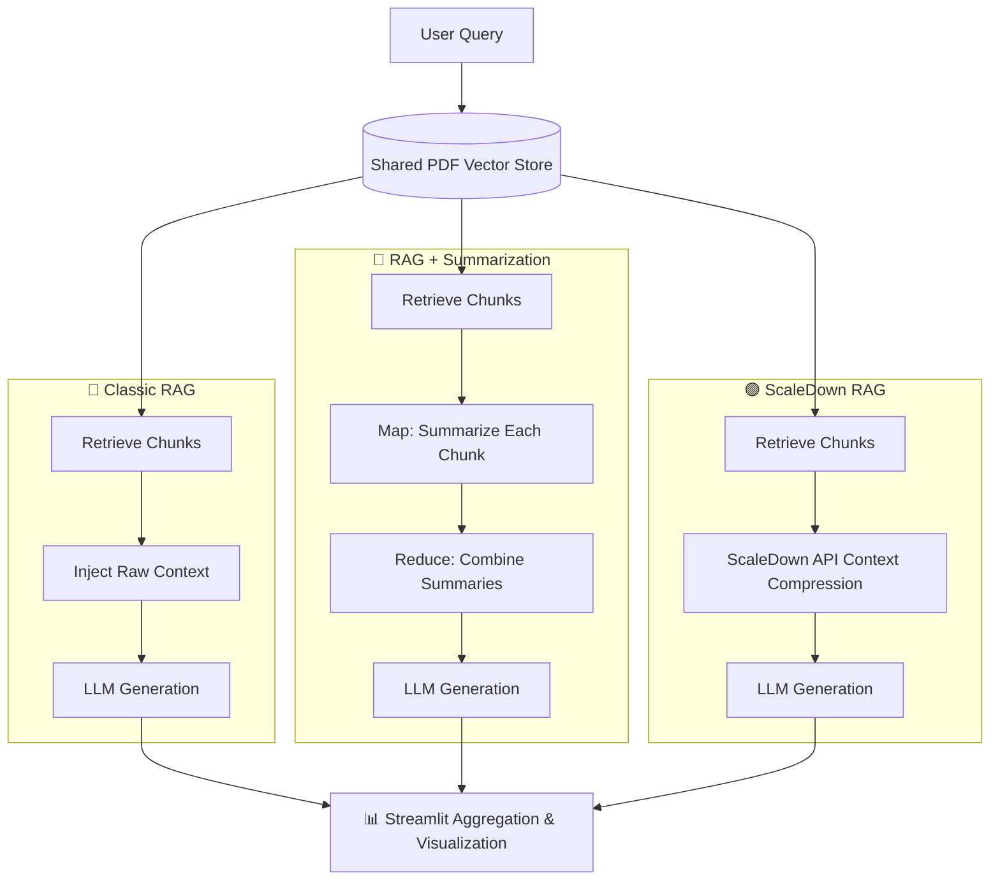

# 🔬 RAG Architecture Comparison & Benchmarking

[](#)
[](https://www.python.org/downloads/)
[](https://opensource.org/licenses/MIT)

A comprehensive framework to experiment, benchmark, and visualize the performance of different Retrieval-Augmented Generation (RAG) architectures. This project specifically compares **Classic RAG**, **Map-Reduce Summarization RAG**, and **ScaleDown Context Compression RAG**.*.*
 *(Note: Dashboard provides real-time Latency, Token Usage, and Quality metrics).*

---

## 🔀 System Workflow Diagram



---

## 🏗️ Architecture Pipelines

This repository implements three distinct RAG pipelines to evaluate how context preparation affects LLM generation latency, cost (tokens), and response quality:

### 1. 🔵 Classic RAG (`classic/`)

The standard baseline approach.

* **Flow**: `Retrieve Chunks` → `Inject into Prompt` → `Generate response`
* **Pros**: Simple, preserves exact context.
* **Cons**: High token usage, higher latency, prone to "lost in the middle" syndrome.

### 2. 🔴 RAG + Summarization (`RAG_summarization/`)

Uses a Map-Reduce approach to condense retrieved context.

* **Flow**: `Retrieve Chunks` → `Map (Summarize each)` → `Reduce (Combine)` → `Generate response`
* **Pros**: Produces high-quality, synthesized answers.
* **Cons**: Massive token overhead (multiple LLM calls), highest overall processing time (though excluded from pure generation latency in benchmarks).

### 3. 🟢 ScaleDown RAG (`scaledown_rag/`)

Utilizes context compression techniques to minimize the prompt payload before generation.

* **Flow**: `Retrieve Chunks` → `Compress Context (ScaleDown)` → `Generate response`
* **Pros**: **Drastically reduces latency** and token cost (~1.4x-2x compression) while maintaining answer quality.

---

## 📊 Streamlit Dashboard

The included interactive Streamlit dashboard (`dashboard/app.py`) visualizes the benchmark results across several dimensions:

* **KPI Cards**: Average/P95 Latency, Average Quality, and average context compression ratios.
* **Latency Breakdown**: Stacked bar charts separating Retrieval vs. Generation times.
* **Token Usage**: Compares Input/Output/Total tokens across pipelines.
* **Multi-Dimensional Analysis**: Radar charts comparing Speed vs. Quality vs. Token Efficiency.

---

## 🚀 Getting Started

### Prerequisites

* Python 3.10+
* Valid API Keys (OpenRouter, OpenAI, ScaleDown, etc.)

### 1. Installation

Clone the repository and install the dependencies:

```bash
git clone https://github.com/jituchoudhary367/Scaledown_rag.git
cd Scaledown_rag

# Create and activate a virtual environment
python -m venv venv_rag
# Windows
.\venv_rag\Scripts\activate
# Mac/Linux
source venv_rag/bin/activate

# Install requirements
pip install -r requirements.txt
```

### 2. Environment Variables

Create a `.env` file in the root directory (this is git-ignored):

```env
OPENROUTER_API_KEY="your_openrouter_api_key"
OPENAI_API_KEY="your_openai_api_key"
SCALEDOWN_API_KEY="your_scaledown_api_key"
LLM_MODEL="nvidia/nemotron-3-super-120b-a12b:free" # Or any OpenRouter/OpenAI model
```

### 3. Running the Benchmark

You can run the full benchmark experiment which will orchestrate all pipelines against shared evaluation questions (`data/questions.txt`) and a shared dataset:

```bash
python experiments/run_all_pipelines.py
```

*This generates `logs/results.csv` and `logs/summary_metrics.csv`.*

### 4. Viewing the Dashboard

Once the experiment is complete, launch the dashboard to visualize the results:

```bash
streamlit run dashboard/app.py
```

---

## 📁 Repository Structure

```text
📦 Scaledown_rag
 ┣ 📂 classic/               # Baseline RAG implementation
 ┣ 📂 RAG_summarization/     # Map-Reduce Summarization RAG
 ┣ 📂 scaledown_rag/         # Context Compression RAG
 ┣ 📂 dashboard/             # Streamlit visualization app
 ┣ 📂 experiments/           # Orchestration and runner scripts
 ┣ 📂 data/                  # Shared evaluation questions and documents
 ┣ 📂 logs/                  # Output CSVs and JSONs (Git-ignored)
 ┣ 📜 shared_config.py       # Global configuration & prompts
 ┣ 📜 requirements.txt       # Project dependencies
 ┗ 📜 README.md              # Documentation
```

---

## 🧠 Key Findings (Sample Benchmark)

Based on a 5-question benchmark against an EPA Climate Change report using `nvidia/nemotron`:

* **ScaleDown RAG** achieved an average latency of **~3.15s** using only **~289 tokens**, representing a significant optimization.
* **Classic RAG** averaged **~13.80s** using **~538 tokens**.
* **Summarization RAG** provided high quality but required processing **~2738 tokens** in the background.

---

## 🤝 Contributing

Contributions, issues, and feature requests are welcome!

## 📝 License

This project is licensed under the MIT License.
